# Project Index

| Kind | Count |
|------|-------|
| 🔴 Boundary | 492 |
| 🟡 Grey | 20 |
| ⚪ Pure Internal | 10944 |
| 📦 External Libraries | 7 |
| 🔵 Stdlib | 72 |
| 🟣 Classes | 1401 |

> **Drill into a module:** `csviz vault . --expand <folder>`
> **Drill into a file:** `csviz vault . --expand <path/to/file.py>`

## External Libraries

- [[libraries/GL|GL]]
- [[libraries/boost|boost]]
- [[libraries/gtest|gtest]]
- [[libraries/kdl|kdl]]
- [[libraries/octomap|octomap]]
- [[libraries/unistd|unistd]]
- [[libraries/urdf_model|urdf_model]]

## Boundary Surface (coupling map)

```mermaid
graph LR
    pr2_arm_kinematics__PR2ArmIKSolver__CartToJnt["CartToJnt"] -->|kdl| lib__kdl["kdl"]
    pr2_arm_kinematics__KDLToEigenMatrix["KDLToEigenMatrix"] -->|kdl| lib__kdl["kdl"]
    pr2_arm_kinematics__PR2ArmIKSolver__PR2ArmIKSolver["PR2ArmIKSolver"] -->|kdl| lib__kdl["kdl"]
    SphericalRobot__SetUp["SetUp"] -->|gtest| lib__gtest["gtest"]
    FloatingJointRobot__SetUp["SetUp"] -->|gtest| lib__gtest["gtest"]
    CollisionDetectorTests__SetUp["SetUp"] -->|gtest| lib__gtest["gtest"]
    KinematicsTest__SetUp["SetUp"] -->|gtest| lib__gtest["gtest"]
    IntegrationTestCommandListManager__SetUp["SetUp"] -->|gtest| lib__gtest["gtest"]
    IntegrationTestCommandPlanning__SetUp["SetUp"] -->|gtest| lib__gtest["gtest"]
    pilz_industrial_motion_planner__GetSolverTipFrameIntegrationTest__SetUp["SetUp"] -->|gtest| lib__gtest["gtest"]
    IntegrationTestPlanComponentBuilder__SetUp["SetUp"] -->|gtest| lib__gtest["gtest"]
    IntegrationTestSequenceAction__SetUp["SetUp"] -->|gtest| lib__gtest["gtest"]
    IntegrationTestSequenceService__SetUp["SetUp"] -->|gtest| lib__gtest["gtest"]
    PlanningContextTest__SetUp["SetUp"] -->|gtest| lib__gtest["gtest"]
    PlanningContextLoadersTest__SetUp["SetUp"] -->|gtest| lib__gtest["gtest"]
    TrajectoryBlenderTransitionWindowTest__SetUp["SetUp"] -->|gtest| lib__gtest["gtest"]
    TrajectoryFunctionsTestBase__SetUp["SetUp"] -->|gtest| lib__gtest["gtest"]
    TrajectoryGeneratorCIRCTest__SetUp["SetUp"] -->|gtest| lib__gtest["gtest"]
    TrajectoryGeneratorCommonTest__SetUp["SetUp"] -->|gtest| lib__gtest["gtest"]
    TrajectoryGeneratorLINTest__SetUp["SetUp"] -->|gtest| lib__gtest["gtest"]
    TrajectoryGeneratorPTPTest__SetUp["SetUp"] -->|gtest| lib__gtest["gtest"]
    World_AddRemoveShape_Test__TestBody["TestBody"] -->|gtest| lib__gtest["gtest"]
    World_TrackChanges_Test__TestBody["TestBody"] -->|gtest| lib__gtest["gtest"]
    World_ObjectPoseAndSubframes_Test__TestBody["TestBody"] -->|gtest| lib__gtest["gtest"]
    WorldDiff_TrackChanges_Test__TestBody["TestBody"] -->|gtest| lib__gtest["gtest"]
    WorldDiff_SetWorld_Test__TestBody["TestBody"] -->|gtest| lib__gtest["gtest"]
    BulletCollisionDetectionTester_DISABLED_ContinuousCollisionSelf_Test__TestBody["TestBody"] -->|gtest| lib__gtest["gtest"]
    BulletCollisionDetectionTester_ContinuousCollisionWorld_Test__TestBody["TestBody"] -->|gtest| lib__gtest["gtest"]
    ContinuousCollisionUnit_BulletCastBVHCollisionBoxBoxUnit_Test__TestBody["TestBody"] -->|gtest| lib__gtest["gtest"]
    ContinuousCollisionUnit_BulletCastMeshVsBox_Test__TestBody["TestBody"] -->|gtest| lib__gtest["gtest"]
```

